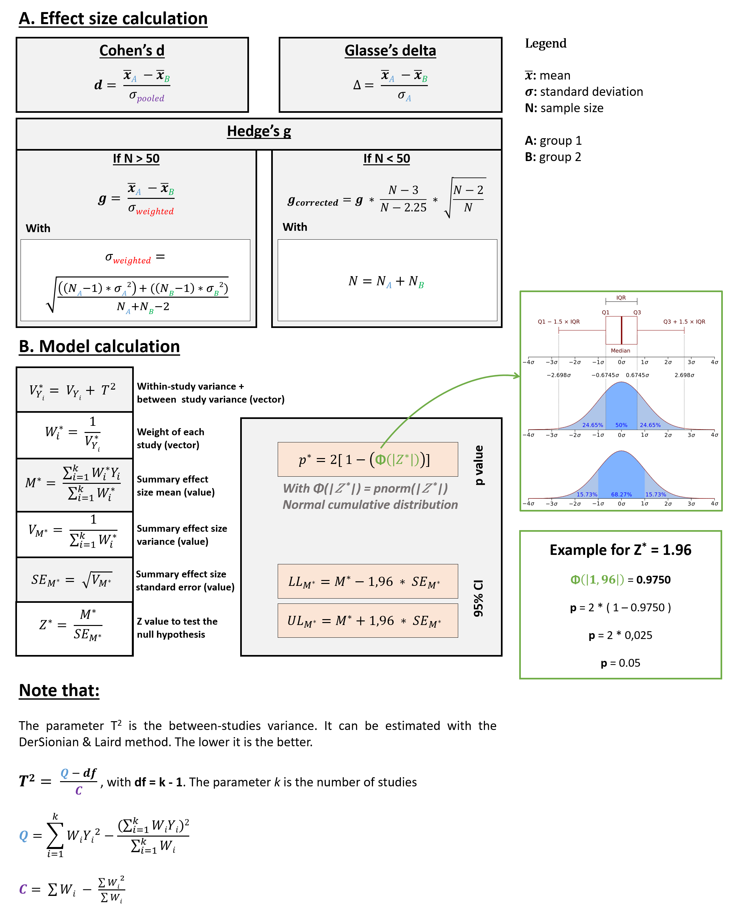

# Meta Analysis

## 📄 Description
This program allows the user to reproduce the results explained in [L. Gardy et al., 2021], and [S. Joubert et al., 2021]. User can use the same process and code to reproduce our results or to perform a new meta-analysis on other data.

## ⚒️ Installation

### Prerequisites
- Python 3.11
- Python libraries
    ```sh
    pip install -r requirements.txt
    ```

## 📝 Usage
The procedure requires only one input file to start: here, *input_data/input_data.csv*. In this table, we find the values ​​recovered in the scientific papers included in the study. It is on the basis of these metrics that comparisons are made and the results of the meta-analysis are calculated, passing through intermediate tables which are automatically created in the *output/* folder during the procedure.

```python
input_data = pd.read_csv(open(r'input_data/input_data.csv','rb'))
studies_with_multiple_measures = get_authors_with_multiple_measures(input_data)
meta_frame = prepare_meta_dataframe.prepare_meta_dataframe(input_data, studies_with_multiple_measures)
meta_frame_summary, Fail_safe_N, global_scores_table = meta_analysis.meta_analysis(meta_frame)
```

### Input data
The _**`input_data.csv`**_ file will be loaded and processed for results calculation and graphical representation. These data were obtained directly from the articles cited in our study, or after contacting the authors to ask them. For more details, please see our article.

### Methods
_**Figure 1**_ shows in detail the theoretical basis used to perform the calculations. For more details on the meta-analyses, please see _**[3]**_. For effect size calculation, user can choose between Cohen's d, Glasse's delta or Hedge's g.



### Results
_**Figure 2**_ shows the results of the meta-analysis, using a random effect model. In this model we assume that the true effect size varies from one study to the next, and that the studies in our analysis represent a random sample of effect sizes that could have been observed. The summary effect is our estimate of the mean of these effects.


### Definition
The fail safe N is the number of studies with null effect size that would be needed to make the p-value of the random effect model greater than 0.05 (non-significant). It helps to estimate the robustness of the meta-analysis.

## 📚 References
[1] Journal paper: S. Joubert, L. Gardy, M. Didic, I. Rouleau, E.J. Barbeau. A meta-analysis of semantic memory in prodromal Alzheimer’s Disease. Neuropsychology Review, 31(2): 221-232, 2021. https://doi.org/10.1007/s11065-020-09453-5
[2] Abstract: L. Gardy, S. Joubert, M. Didic, I. Rouleau, E.J. Barbeau. A meta-analysis of semantic memory in Mild Cognitive Impairment. Brain and cognition, 137:103642. Cognitive neuroscience of memory: The Recollection, Familiarity and Novelty detection conference (RFN), 2019. https://doi.org/10.1016/j.bandc.2019.10.011
[3] Book: Michael Borenstein, Hannah R. Rothstein, Larry V. Hedges, Julian Higgins. An Introduction to Meta-Analysis (2009). ISBN: 9780470057247

## 👤 Author
- LinkedIn: [Ludovic Gardy](https://www.linkedin.com/in/ludovic-gardy/)
- Doctoral thesis: [PDF](http://thesesups.ups-tlse.fr/5164/1/2021TOU30190.pdf)