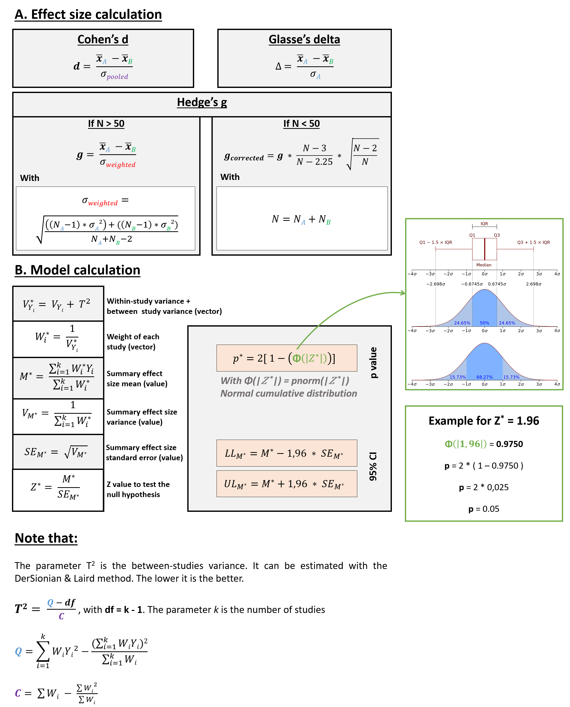
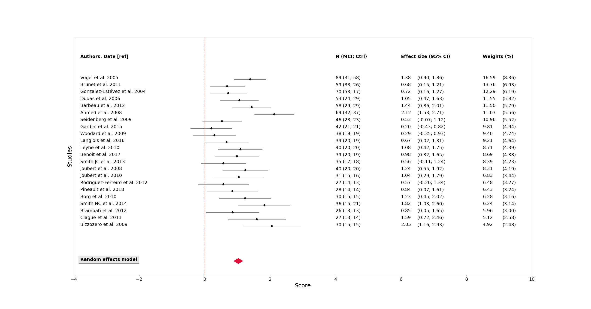

# Description
This program allows the user to reproduce the results explained in _**[1, 2]**_.

Please, open _**`main.py`**_ and change the path inside to use the program.

# Procedure example (main.py)
```
meta_data = pd.read_excel(open(r'~/Data_meta.xlsx','rb'))

meta_frame = reshape_dataframe.reshape_dataframe(meta_data, authors_list)
meta_frame_summary, Fail_safe_N = calcul_meta_analysis.calcul_meta_analysis(meta_frame)
```

# Some information about the dataset
The _**`meta_data.xlsx`**_ file will be loaded and processed for results calculation and graphical representation. These data were obtained directly from the articles cited in our study, or after contacting the authors to ask them. For more details, please see our article.

# Methods
Figure 1 shows in detail the theoretical basis used to perform the calculations. For more details on the meta-analyses, please see _**[3]**_



# Results
Figure 2 shows the results of the meta-analysis, using a random effect model. In this model we assume that the true effect size varies from one study to the next, and that the studies in our analysis represent a random sample of effect sizes that could have been observed. The summary effect is our estimate of the mean of these effects.



# References
[1] Journal paper: S. Joubert, L. Gardy, M. Didic, I. Rouleau, E.J. Barbeau. A meta-analysis of semantic memory in prodromal Alzheimer’s Disease. Neuropsychology Review, 31(2): 221-232, 2021. https://doi.org/10.1007/s11065-020-09453-5

[2] Abstract: L. Gardy, S. Joubert, M. Didic, I. Rouleau, E.J. Barbeau. A meta-analysis of semantic memory in Mild Cognitive Impairment. Brain and cognition, 137:103642. Cognitive neuroscience of memory: The Recollection, Familiarity and Novelty detection conference (RFN), 2019. https://doi.org/10.1016/j.bandc.2019.10.011

[3] Book: Michael Borenstein, Hannah R. Rothstein, Larry V. Hedges, Julian Higgins. An Introduction to Meta-Analysis (2009). ISBN: 9780470057247

# Dependencies
- sklearn==0.22.2.post1
